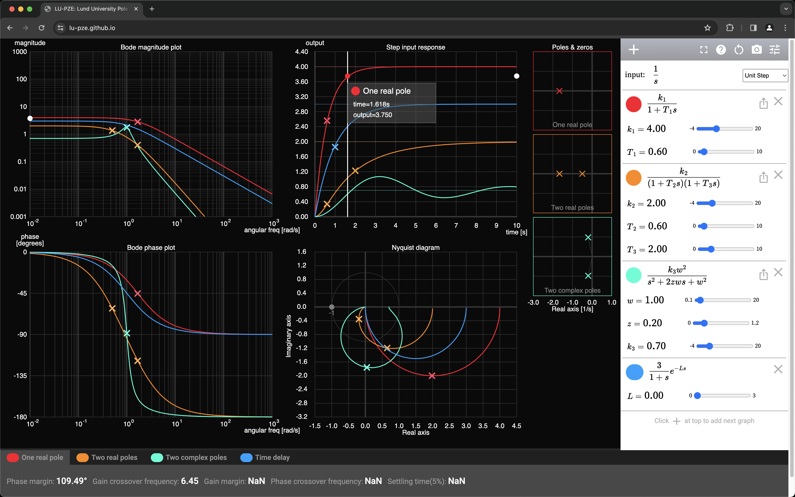

# LU-PZE - Lund University Pole-Zero Explorer
an Automatic Control theory playground

Inspired by Desmos: https://www.desmos.com/calculator

Inspired by ILM Physical Modeling: https://www.researchgate.net/publication/289050547_Interactive_Learning_Module_Basic_Modelling_and_Identification_Concepts

Based on Bowde: https://github.com/nnnawi/BOWDE

A screenshot, which is probably obsolete already:

...so please run the live version yourself: https://lu-pze.github.io
